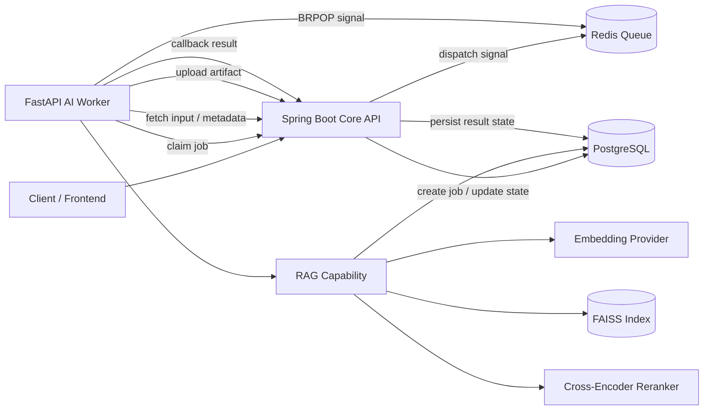

# async-ocr-rag-multimodal-pipeline

Spring Boot API 서버와 FastAPI Worker를 분리하여, RAG 검색 및 AI 처리 작업을 비동기 파이프라인으로 실행하는 포트폴리오 프로젝트입니다.

이 프로젝트는 단순한 LLM API 호출 예제가 아니라, **AI 작업을 백엔드 서비스 구조 안에서 안정적으로 처리하는 방식**을 실험하는 데 목적이 있습니다.  
작업 요청은 PostgreSQL 기반 Job 상태로 관리하고, Worker는 queue 신호만으로 바로 실행하지 않고 `claim-before-execute` 방식으로 작업 소유권을 확보한 뒤 실행합니다.

현재 구현 범위는 **비동기 작업 파이프라인 + Text RAG + 검색 평가/튜닝**이며,  
RAG 검색 품질은 **Phase 7까지 진행**되어 retrieval-title embedding A/B, reranker A/B 하네스, 신뢰도 검출기, controlled recovery loop를 갖추고 있습니다.  
OCR, file parsing, multimodal capability는 이후 phase에서 확장할 예정입니다.

---

## What this project demonstrates

이 저장소는 다음 질문에 답하기 위해 만들었습니다.

> RAG, OCR, multimodal 같은 AI 작업을 단순 함수 호출이 아니라  
> 운영 가능한 백엔드 작업 흐름으로 설계하려면 어떤 구조가 필요한가?

핵심 설계 포인트는 다음과 같습니다.

- Spring Boot 기반 `core-api`와 Python/FastAPI 기반 `ai-worker` 분리
- PostgreSQL을 Job 상태의 Source of Truth로 사용
- Redis는 상태 저장소가 아니라 dispatch signal 역할로 제한
- Worker 실행 전 `claim`을 통한 작업 소유권 확보
- callback 기반 결과 반영
- artifact 기반 입력/출력 관리
- RAG capability를 독립 모듈로 구성
- FAISS + sentence-transformers 기반 vector retrieval
- cross-encoder reranker 평가
- hit@k, MRR, NDCG, latency 기반 검색 품질 측정
- Optuna 기반 retrieval parameter tuning 실험

---

## Current status

| Area | Status | Notes |
|---|---|---|
| Async job pipeline | Done | job / artifact / claim / callback |
| Local worker dispatch | Done | Redis BRPOP 기반 dispatch |
| Job state management | Done | PostgreSQL이 Source of Truth |
| Text RAG | Done | FAISS + sentence-transformers |
| Reranker evaluation | Done | `BAAI/bge-reranker-v2-m3` |
| Retrieval evaluation | Done | hit@k, MRR, NDCG, latency |
| Optuna tuning | In progress | retrieval parameter tuning 실험 |
| Retrieval embedding A/B (Phase 7.0) | Done | `retrieval_title_section` 변형이 v4 silver 200 기준 hit@1 +22pt |
| Reranker A/B harness (Phase 7.1) | Done (run pending) | 하네스/CLI/테스트 완비, 풀 cross-encoder 실행은 GPU 일정 대기 |
| Production embedding-text 승격 (Phase 7.2) | Done | ingest 기본값 = `retrieval_title_section`, manifest sidecar로 검증 |
| Retrieval confidence detector (Phase 7.3) | Done | per-query 신뢰도 라벨 + recovery action 추천 |
| Controlled recovery loop (Phase 7.4) | Done (silver) | hybrid(BM25+RRF) / query rewrite, oracle vs production-like 분기 |
| OCR input | Planned | file / PDF → OCR_TEXT |
| Multimodal capability | Planned | image / document understanding |
| Real LLM generation | Planned | local/API provider abstraction |

---

## Architecture



---

## Design principles

### 1. PostgreSQL owns job state

Redis는 queue 신호를 전달할 뿐, 작업 상태를 소유하지 않습니다.  
실제 Job 상태는 PostgreSQL에 저장되며, Worker는 실행 전 core-api에 claim을 요청합니다.

이 구조를 통해 다음 문제를 줄입니다.

- 같은 작업이 여러 Worker에서 중복 실행되는 문제
- queue 재전송으로 인해 결과가 중복 반영되는 문제
- callback 실패 후 재시도 시 상태가 꼬이는 문제
- Worker 장애 이후 작업 상태를 추적하기 어려운 문제

---

### 2. Claim before execute

Worker는 Redis에서 작업 신호를 받더라도 즉시 실행하지 않습니다.  
먼저 core-api에 claim을 요청하고, claim에 성공한 작업만 실행합니다.

```text
Redis signal
  → Worker receives job id
  → Worker requests claim
  → Core API checks current job state
  → Claim succeeds or fails
  → Worker executes only if claim succeeds
```

이 방식은 queue가 at-least-once delivery 성격을 가지더라도, 실제 실행 소유권은 DB 상태로 제어할 수 있게 합니다.

---

### 3. Queue is replaceable

현재 구현은 로컬 재현성과 GPU 비용 절감을 위해 Redis 기반 dispatch를 사용합니다.

다만 Redis는 작업 상태를 소유하지 않고 dispatch signal 역할만 수행하므로, 구조적으로는 Cloud Tasks, Pub/Sub, SQS 같은 managed queue로 교체할 수 있습니다.

```text
Current:
Spring Core API → Redis → FastAPI Worker

Possible production adapter:
Spring Core API → Cloud Tasks / Pub/Sub / SQS → FastAPI Worker
```

이 저장소는 실제 클라우드 GPU 배포보다, **로컬/단일 머신 환경에서 전체 비동기 AI 처리 흐름을 재현하는 것**을 우선했습니다.

---

### 4. Capability is pluggable

Worker는 capability 단위로 AI 작업을 실행합니다.

현재 구현된 capability:

- `MOCK`
- `RAG`

확장 예정 capability:

- `OCR`
- `MULTIMODAL`
- real LLM generation

Capability 구조를 분리해두었기 때문에, 향후 OCR이나 multimodal processing을 추가하더라도 job / artifact / claim / callback 흐름은 유지할 수 있습니다.

---

## Core components

### core-api

Spring Boot 기반 백엔드 API 서버입니다.

역할:

- Job 생성
- Job 상태 관리
- Worker claim 처리
- artifact metadata 관리
- callback 수신
- 내부 API 인증
- RAG metadata schema 관리

구조:

```text
domain
application
  ├── port
  └── service
adapter
  ├── in/web
  ├── out/persistence
  ├── out/queue
  └── out/storage
```

---

### ai-worker

Python/FastAPI 기반 AI Worker입니다.

역할:

- Redis queue 신호 수신
- core-api에 claim 요청
- 입력 artifact 로드
- capability 실행
- 결과 artifact 업로드
- callback 전송

기본 실행 흐름:

```text
Redis BRPOP
  → claim
  → fetch input
  → execute capability
  → upload output artifact
  → callback
```

---

### RAG capability

현재 가장 많이 구현된 capability입니다.

구성 요소:

- JSONL corpus ingestion
- token-aware chunking
- sentence-transformers embedding (`retrieval_title_section` 변형이 production 기본값, Phase 7.2)
- FAISS `IndexFlatIP`
- vector retrieval
- optional cross-encoder reranking
- extractive generation provider
- retrieval evaluation harness (paired A/B, hit@k / MRR / NDCG / latency)
- retrieval confidence detector (Phase 7.3)
- controlled recovery loop: hybrid(BM25+RRF) / query rewrite (Phase 7.4, eval-only)
- Optuna tuning workflow

---

## Tech stack

| Area | Stack |
|---|---|
| Backend | Java 21, Spring Boot 4.0.3, Maven |
| Worker | Python 3.12, FastAPI |
| Database | PostgreSQL 18 |
| Queue / Dispatch | Redis |
| Vector Search | FAISS `IndexFlatIP` |
| Embedding | `bge-m3`, embedding-text variant = `retrieval_title_section` (default) |
| Reranker | `BAAI/bge-reranker-v2-m3` |
| Hybrid retrieval (recovery only) | BM25 + RRF (eval-only, Phase 7.4) |
| Evaluation | hit@k, recall@k, MRR, NDCG, latency |
| Infra | Docker Compose |
| Storage | Local filesystem, S3/MinIO adapter-ready |

---

## Repository structure

```text
.
├── core-api/                        Spring Boot — jobs / artifacts / claim / callback
│   └── src/main/resources/db/migration/
│       ├── V1__init.sql             pipeline schema
│       └── V2__ragmeta_schema.sql   RAG metadata schema
│
├── ai-worker/                       Python worker
│   ├── app/capabilities/
│   │   ├── mock_processor.py         MOCK capability
│   │   └── rag/                      RAG capability
│   │       ├── capability.py         entry point
│   │       ├── chunker.py            chunking logic
│   │       ├── embeddings.py         embedding provider
│   │       ├── generation.py         generation provider
│   │       ├── faiss_index.py        FAISS wrapper
│   │       ├── metadata_store.py     ragmeta DAO
│   │       ├── ingest.py             JSONL → chunks → FAISS
│   │       └── retriever.py          query → retrieved chunks
│   │
│   ├── scripts/build_rag_index.py    indexing CLI
│   ├── eval/                         evaluation harness
│   └── fixtures/                     small committed fixtures
│
├── frontend/                         minimal HTML test client
├── scripts/e2e_smoke.py              end-to-end smoke test
├── docker-compose.yml                Redis / PostgreSQL / MinIO profiles
├── .env.example                      environment variable reference
└── docs/
    ├── architecture.md
    ├── local-run.md
    ├── api-summary.md
    ├── tuning.md
    └── optuna-tuning-plan.md
```

---

## RAG evaluation results

검색 성능은 `anime_silver_200` 데이터셋을 기준으로 평가했습니다.

- Corpus: 1,764 documents
- Queries: 200 deterministic synthetic queries
- Environment: RTX 5080 16GB
- Embedder: `bge-m3`
- Vector index: FAISS `IndexFlatIP`
- Reranker: `BAAI/bge-reranker-v2-m3`

상세 리포트는 `ai-worker/eval/reports/` 아래 phase별 하위 디렉토리에 JSON과 Markdown으로 커밋되어 있습니다.

---

### Phase 0 — fixture baseline

Small committed fixtures 기준 baseline입니다.

| dataset | hit@5 | recall@5 | MRR | dup_rate | topk_gap | p50/p95 ret (ms) |
|---|---:|---:|---:|---:|---:|---:|
| anime (en, 8 docs) | 1.000 | 1.000 | 1.000 | 0.433 | 0.236 | 8.6 / 24.9 |
| kr_sample (kr, 10) | 1.000 | 1.000 | 1.000 | 0.340 | 0.233 | 8.7 / 27.4 |

OCR row는 현재 환경에 Tesseract / 언어팩이 없어 측정하지 않았습니다.

---

### Phase 2A — silver-200 cross-encoder reranker progression

| run | hit@1 | hit@3 | hit@5 | MRR@10 | NDCG@10 | rerank p95 ms |
|---|---:|---:|---:|---:|---:|---:|
| B1 dense (combined-old) | 0.560 | 0.670 | 0.685 | 0.617 | 0.643 | – |
| B2 dense (token-aware-v1) | 0.540 | 0.665 | 0.680 | 0.604 | 0.631 | – |
| **B2 + rerank top20** | 0.605 | 0.680 | 0.700 | 0.653 | 0.675 | 706 |
| **B2 + rerank top50** | **0.615** | **0.700** | **0.715** | **0.666** | **0.689** | 1840 |

Reranker 적용 결과 dense baseline 대비 hit@1, hit@5, MRR@10, NDCG@10이 개선되었습니다.  
다만 rerank top50은 품질은 가장 좋지만 p95 latency가 커지므로, 실제 서비스 적용 시에는 품질과 지연 시간의 trade-off를 고려해야 합니다.

---

### Candidate-recall ceiling

Reranker는 후보 문서의 순서를 재배치할 뿐, dense retrieval 단계에서 후보에 들어오지 않은 문서는 복구할 수 없습니다.  
따라서 dense top-N의 recall은 reranker 성능의 상한선입니다.

B2 dense top-50 기준:

| metric | value |
|---|---:|
| hit@10 | 0.715 |
| hit@20 | 0.770 |
| hit@50 | 0.800 |

---

### Selected baseline

`legacy-baseline-final/` 기준 selected baseline:

| metric | value |
|---|---:|
| hit@1 | 0.620 |
| hit@3 | 0.675 |
| hit@5 | 0.705 |
| MRR@10 | 0.654 |
| total query p95 | 350 ms |

이 baseline은 agent loop legacy backend의 reference manifest로 사용됩니다.

---

### Phase 7 — v4 corpus, retrieval-title embedding A/B

Phase 6.3에서 만든 v4 namu 코퍼스 (`namu-v4-structured-combined-2008-2026-04-phase6_3_title_alias_quality`) 위에서 진행한 검색 실험입니다.  
이전 phase들과는 다른 코퍼스이므로 절대 수치를 직접 비교하지 마시고, **변형 간 차이(Δ)** 만 비교 대상으로 보십시오.

- Corpus: 4,314 documents / 135,602 chunks (v4 page-level, Phase 6.3 산출물)
- Queries: 200 deterministic v4 silver queries (`subpage_generic` 90 / `main_work` 60 / `subpage_named` 50, seed=42)
- Index: FAISS `IndexFlatIP`, bge-m3, max_seq_length=512, dense-only
- 평가는 silver 쿼리 셋이며, 사람 검수 gold가 아닙니다 — 절대 정확도가 아니라 변형 간 비교에 한정해 해석해야 합니다.

#### Phase 7.0 — `retrieval_title_section` embedding A/B

| metric | baseline (`title_section`) | candidate (`retrieval_title_section`) | Δ |
|---|---:|---:|---:|
| hit@1 | 0.595 | **0.815** | **+0.220** |
| hit@3 | 0.710 | **0.935** | **+0.225** |
| hit@5 | 0.740 | **0.960** | **+0.220** |
| hit@10 | 0.795 | **0.985** | **+0.190** |
| MRR@10 | 0.663 | **0.882** | **+0.219** |
| nDCG@10 | 0.695 | **0.907** | **+0.213** |

improved : regressed = **74 : 3**.  
효과는 `subpage_generic` (등장인물 / 평가 / 음악 등 generic page_title) 버킷에 집중되며 (+40pt hit@1), `main_work` 버킷은 설계상 무영향(±0pt)으로 확인되었습니다.  
상세는 `ai-worker/eval/reports/.../phase7_0_retrieval_title_ab/PHASE7_0_FINAL_REPORT.md`에 있습니다.

#### Phase 7.2 — production ingest 승격

Phase 7.0의 후보 변형을 ingest 기본값으로 끌어올렸습니다.

- 공통 builder: `app/capabilities/rag/embedding_text_builder.py` (ingest와 v4 eval harness가 동일 함수 호출)
- `ingest_manifest.json` sidecar에 variant / builder version / per-chunk SHA를 기록해 export와 byte-for-byte 검증 가능
- config 키: `rag_embedding_text_variant` (default: `retrieval_title_section`, rollback: `title_section`)

#### Phase 7.3 — retrieval confidence detector

Phase 7.0/7.1의 per-query 산출물을 후처리해, 쿼리 단위로 신뢰도 라벨과 recovery 액션을 산출합니다.

| label | n | share |
|---|---:|---:|
| CONFIDENT | 8 | 4.0% |
| AMBIGUOUS | 177 | 88.5% |
| LOW_CONFIDENCE | 12 | 6.0% |
| FAILED | 3 | 1.5% |

추천 액션: `ANSWER` 8 / `ANSWER_WITH_CAUTION` 177 / `HYBRID_RECOVERY` 4 / `QUERY_REWRITE` 7 / `INSUFFICIENT_EVIDENCE` 4.  
판단 근거(top-1 score, top1-top2 margin, page-id consistency, generic-section 충돌, gold rank, title/section-intent matching, 옵션으로 Phase 7.1의 rerank-demoted-gold)는 모두 출력 JSONL의 `signals` 블록에 노출됩니다.  
production 검색 경로는 변경되지 않았으며, 분류기 출력만 별도 산출물로 떨어집니다.

#### Phase 7.4 — controlled recovery loop (eval-only)

Phase 7.3 verdict를 입력 받아 ATTEMPT 분기에 한해 결정론적 recovery를 실행합니다.

- `INSUFFICIENT_EVIDENCE` → 거절 (검색 시도 안 함)
- `ANSWER_WITH_CAUTION` → 이번 phase에서는 calibration 용도로만 보존, recovery 미수행
- `HYBRID_RECOVERY` → 신선 색인의 BM25 풀과 Phase 7.0 dense top-N을 RRF 융합
- `QUERY_REWRITE` → **oracle**(`expected_title` 사용, 상한선 측정용)과 **production-like**(top-N 후보 canonical title만 사용) 두 모드. strict 모드에서 production-like가 `expected_title`을 보면 `LabelLeakageError` 발생

silver-set 결과: 207 verdicts 중 ATTEMPT 11 (HYBRID 4, REWRITE 7), recovered 0, regressed 1, BM25 retrieve p50 833 ms / p99 1,737 ms.  
production retrieval 코드는 손대지 않았고 LLM rewriter도 사용하지 않으므로, 모든 시도는 입력만으로 재현 가능합니다.

> **참고.** 7.3 / 7.4의 절대 수치는 silver 쿼리 셋 기준이며 사람 검수 gold가 아닙니다. 휴먼 audit / silver_500 확장은 차기 phase 작업입니다.

---

## Reproduce evaluation

모든 명령은 `ai-worker/` 디렉토리에서 실행합니다. (`cd ai-worker`)  
phase별 절차는 아래 토글을 펼쳐 확인합니다.

<details>
<summary><b>Phase 0 — fixture baseline</b></summary>

```bash
python -m eval.run_eval rag \
    --dataset eval/datasets/rag_sample_kr.jsonl \
    --offline-corpus fixtures/kr_sample.jsonl \
    --out-json eval/reports/baseline-phase0.json
```

</details>

<details>
<summary><b>Phase 2A — candidate recall</b></summary>

```bash
python -m eval.run_eval retrieval \
    --corpus  eval/corpora/anime_namu_v3_token_chunked/corpus.combined.token-aware-v1.jsonl \
    --dataset eval/eval_queries/anime_silver_200.jsonl \
    --top-k 50 \
    --extra-hit-k 10 \
    --extra-hit-k 20 \
    --extra-hit-k 50 \
    --out-dir eval/reports/phase2a-reranker/candidate-recall-b2
```

</details>

<details>
<summary><b>Phase 2A — rerank sweep (top-20 / top-50)</b></summary>

```bash
for N in 20 50; do
  python -m eval.run_eval retrieval-rerank \
      --corpus  eval/corpora/anime_namu_v3_token_chunked/corpus.combined.token-aware-v1.jsonl \
      --dataset eval/eval_queries/anime_silver_200.jsonl \
      --dense-top-n $N \
      --final-top-k 10 \
      --reranker-model BAAI/bge-reranker-v2-m3 \
      --reranker-batch-size 16 \
      --out-dir eval/reports/retrieval-silver200-combined-token-aware-v1-rerank-top$N
done
```

</details>

<details>
<summary><b>Phase 7.0 — retrieval-title embedding A/B (v4)</b></summary>

전체 파이프라인을 한 번에 돌리는 orchestrator입니다. 부분 재실행은 `--skip-export / --skip-diff / --skip-index-build / --skip-ab` 플래그로 제어합니다.

```bash
python -m scripts.run_phase7_0_retrieval_title_ab \
    --src-chunks <Phase 6.3 rag_chunks.jsonl> \
    --pages-v4   <Phase 6.3 pages_v4.jsonl> \
    --report-dir eval/reports/namu-v4-structured-combined-2008-2026-04-phase7_0_retrieval_title_ab \
    --target-queries 200
```

</details>

<details>
<summary><b>Phase 7.3 / 7.4 — confidence + controlled recovery</b></summary>

```bash
# Phase 7.3 — confidence labelling on top of Phase 7.0 outputs
python -m scripts.run_phase7_3_confidence_eval \
    --per-query      eval/reports/.../phase7_0_retrieval_title_ab/per_query_comparison.jsonl \
    --chunks         eval/reports/.../phase7_0_retrieval_title_ab/rag_chunks_retrieval_title_section.jsonl \
    --silver-queries eval/reports/.../phase7_0_retrieval_title_ab/queries_v4_silver.jsonl \
    --report-dir     eval/reports/.../phase7_3_confidence_eval \
    --side candidate

# Phase 7.4 — controlled recovery loop (oracle vs production-like)
python -m scripts.run_phase7_4_controlled_recovery \
    --per-query        eval/reports/.../phase7_3_confidence_eval/per_query_confidence.jsonl \
    --chunks-jsonl     eval/reports/.../phase7_0_retrieval_title_ab/rag_chunks_retrieval_title_section.jsonl \
    --report-dir       eval/reports/.../phase7_4_controlled_recovery \
    --rewrite-mode both \
    --strict-label-leakage
```

</details>

---

## Local run

Mode A는 기존 PostgreSQL `:5432`를 재사용하는 기본 실행 방식입니다.  
Mode B는 독립 `postgres:18`을 `:5433`에서 실행하는 방식이며, 자세한 내용은 `docs/local-run.md`를 참고합니다.

<details>
<summary><b>실행 명령어 (Redis → core-api → ai-worker → smoke test)</b></summary>

```bash
# 1. Start Redis
docker compose up -d redis

# 2. Start core-api
cd core-api
mvn spring-boot:run

# 3. Start ai-worker
cd ../ai-worker
pip install -r requirements.txt
python -m app.main

# 4. Run smoke test
cd ..
python scripts/e2e_smoke.py
```

</details>

---

## Internal endpoint authentication

`/api/internal/**` 엔드포인트는 `X-Internal-Secret`으로 게이팅합니다.

| Service | Environment variable |
|---|---|
| core-api | `AIPIPELINE_INTERNAL_SECRET` |
| ai-worker | `AIPIPELINE_WORKER_INTERNAL_SECRET` |

두 서비스의 secret 값은 동일해야 합니다.  
둘 다 미설정인 경우 core-api는 개발 편의를 위해 WARN 로그를 남긴 뒤 pass-through합니다.

---

## Storage

기본 storage backend는 local filesystem입니다.

S3 / MinIO 전환을 위해 storage port가 분리되어 있습니다.

<details>
<summary><b>MinIO 부팅 + 환경변수</b></summary>

```bash
docker compose --profile minio up -d minio minio-bootstrap
```

MinIO 사용 시 주요 환경변수:

```bash
AIPIPELINE_STORAGE_BACKEND=s3
AIPIPELINE_STORAGE_S3_ENDPOINT=...
AIPIPELINE_WORKER_S3_ENDPOINT=...
AIPIPELINE_WORKER_S3_ACCESS_KEY=...
AIPIPELINE_WORKER_S3_SECRET_KEY=...
```

자세한 환경변수 목록은 `.env.example`을 참고합니다.

</details>

---

## Demo

`scripts/demo.py`는 샘플 PDF를 생성하고 capability pipeline을 실행하는 데모 스크립트입니다.  
현재 OCR / multimodal capability는 planned 상태이므로, 실제 사용 가능 범위는 현재 구현 상태에 맞춰 확인해야 합니다.

<details>
<summary><b>실행 명령어</b></summary>

```bash
pip install reportlab rich

python scripts/demo.py
python scripts/demo.py --capability OCR --question "What metrics are shown?"
python scripts/demo.py --self-test
```

</details>

---

## Development phases

| Phase | Description |
|---|---|
| Phase 1 | 비동기 skeleton: job / artifact / claim / callback / Redis dispatch / MOCK |
| Phase 1.1 | target stack 안정화: Spring Boot 4.0.3 / Java 21 / PostgreSQL 18 / Python 3.12 / Redis |
| Phase 2 | text-RAG capability: FAISS + sentence-transformers + extractive generator + ragmeta schema |
| Phase 1B | namu-wiki corpus prefix / inline-edit-marker strip |
| Phase 1C | token-aware chunker: 1024-token hard cap, avg ctx tokens 531 → 293 |
| Phase 2A | `bge-reranker-v2-m3` cross-encoder reranker evaluation |
| Phase 6.3 | v4 namu corpus: title / alias 정합성, retrieval_title 도입, page_id 안정화 |
| Phase 7.0 | `retrieval_title_section` embedding A/B over v4 silver 200 — hit@1 +22pt, MRR +21.9pt |
| Phase 7.1 | reranker A/B 하네스 (cross-encoder full run은 GPU 일정 대기) |
| Phase 7.2 | production ingest 기본값을 `retrieval_title_section`으로 승격 + manifest sidecar |
| Phase 7.3 | retrieval confidence detector / failure classifier (CONFIDENT / AMBIGUOUS / LOW_CONFIDENCE / FAILED) |
| Phase 7.4 | controlled recovery loop (BM25+RRF hybrid / query rewrite, oracle vs production-like) |
| Phase 2.1 | OCR + file input flow |
| Phase 3+ | multimodal capability, real LLM generation, MinIO/S3 adapter, retry orchestration, K8s manifests |

---

## Roadmap

### Near-term

- silver-set 한계 극복: human-audit gold seed 확보 + silver_500 확장 (Phase 7.x 후속)
- Phase 7.1 reranker full run (GPU 시간 확보 시): 풀 cross-encoder A/B + default-on 기준 평가
- Phase 7.3 신뢰도 임계값 튜닝 (특히 `min_margin`이 200쿼리 중 183개에서 발화하는 over-fire 문제)
- OCR capability 추가
- file / PDF input pipeline 구성
- `INPUT_FILE → OCR_TEXT → RAG` 재소비 흐름 구현
- real LLM generation provider 추가
- tuning workflow 문서 개선

### Mid-term

- multimodal capability 추가
- S3 / MinIO artifact storage 안정화
- capability별 dispatch lane 분리
- retry orchestration 고도화
- frontend 개선

### Later

- Cloud Tasks / Pub/Sub / SQS adapter 검토
- Kubernetes manifest 추가
- GPU worker deployment 전략 정리
- production-like observability 추가

---

## Documentation

### Design / Operations / API

- `docs/architecture.md` — system architecture, design decisions, capability flows, trace schema
- `docs/api-summary.md` — HTTP endpoints, request/response shape, error codes
- `docs/local-run.md` — local bootstrap, troubleshooting, capability activation guide

### Evaluation

- `ai-worker/eval/README.md` — eval harness overview, metric definitions, recommended sequence
- `ai-worker/eval/datasets/README.md` — eval dataset catalog
- `ai-worker/eval/corpora/README.md` — retrieval corpus directory convention
- `ai-worker/eval/corpora/anime_namu_v3/README.md` — namu-wiki anime corpus schema
- `ai-worker/eval/eval_queries/README.md` — retrieval eval query sets

### Tuning

- `docs/tuning.md` — Optuna + Claude interpreter loop guide
- `docs/optuna-tuning-plan.md` — tuning pipeline roadmap
- `ai-worker/eval/experiments/README.md` — round-refinement workspace

### Frontend

- `frontend/app/README.md` — Vite + React + TypeScript setup notes

---

## Notes

이 프로젝트의 현재 초점은 “모든 AI capability를 완성하는 것”이 아니라,  
AI 작업을 안정적으로 실행할 수 있는 **백엔드 파이프라인 구조**와  
RAG 검색 품질을 측정하고 개선할 수 있는 **평가/튜닝 기반**을 만드는 것입니다.

따라서 OCR / multimodal / real LLM generation은 roadmap으로 남겨두고,  
현재는 다음 세 가지를 우선 검증했습니다.

1. 비동기 작업 처리 구조가 안정적으로 동작하는가
2. RAG 검색 파이프라인을 평가하고 개선할 수 있는가 (Phase 7.0 dense embedding A/B로 hit@1 +22pt)
3. 검색이 실패했을 때 *언제* 그리고 *어떻게* recovery할지 결정론적으로 분류·실행할 수 있는가 (Phase 7.3 / 7.4)
